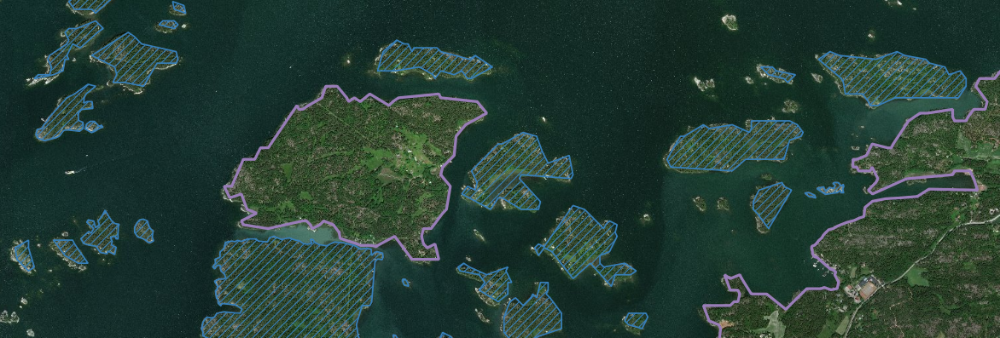

# HOTOSM Activation GIS workflows

This file is a compilation of notes made during HOTOSM activations for tasks relating to the Data, Usability, Imagery, and Validation roles.

Most practical workflows described use recent versions of QGIS, but are typically general enough to perform in any GIS (Arc, python, R,...).

# File Formats and Projections (CRS)

It's convenient to save small datasets as `EPSG:4326` (WGS84) projected geojson files. Many hotosm tools are web-based, and use geojson as the input and output format. QGIS itself can deal with most GIS file formats and CRS mostly automatically, but many web-based tools used in hotosm work can be very particular.

Use `EPSG:3857` (Pseudo-Mercator) as the project CRS in QGIS. `EPSG:3857` is the default projection of OSM. It's coordinate unit is meters instead of degrees, making it useful when e.g. buffering shapes. Most OMS tile sets and satellite imagery in published as TMS also use this CRS.


Recommended file formats for different tools:

Tool | File Format | Projection | Note
-----|-------------|------------|----
Export Tool | Geojson | EPSG:4326 (WGS 84) | File should be one layer with one polygon only.
Tasking Manager | Geojson | EPSG:4326 (WGS 84) | Project task definition file: one polygon layer, each polygon can be used as and individual project task.
uMap | Geojson | EPSG:4326 (WGS 84) | May have arbitrary geometry and attribute data
JOSM | GPX |  EPSG:4326 (WGS 84) | Point or line geometry. Deselect all attribute data fields when exporting from QGIS


# TM Projects for many small villages

In areas where there are a large amount of small dispersed villages, it's effective to create individual tasks for the villages in the project. This prevents mappers' time being wasted searching through empty task squares.

We use project [#6061 – Peru remote villages](https://tasks.hotosm.org/project/6061#bottom) as an example.


## Step 1. Estimate the locations of villages.

Build a layer with at least one feature per village.

In #6061 was created using a point layer consisting of:

- OSM nodes tagged as "place"="village" or "place"="hamlet"
- OSM nodes tagged as "amenity"="school"
- Peru national data record hosted by GeoIDEP helped finding settlements ("Lugares Poblados") with > 150 population


Choosing which tags to target is a manual process. In #6061 it was lucky that the location information of shools in Peru had already been imported to OSM. Many villages had no other mapping done (no buildings, roads etc.) except for one "amenity"="school" node.

Manually adding points may be necessary in some cases.

## Setp 2. Building the Tasking Manager Project.


1. *Reproject* POIs to something suitable, such as *EPSG:3857* (WGS 84 Pseudo Mercator), where the coordinate unit is meters instead of degrees. Vector > Data Management Tools > Reproject Layer
3. *Buffer* points of interest by 500m. Vector > Geoprocessing Tools > Buffer
4. *Dissolve* buffered areas so that overlapping areas are combined into one polygon. Vector > Geoprocessing Tools > Dissolve
5. In the dissolve output, split any possible *mulitpart polygons to singleparts*. Vector > Geometry Tools > Multipart to Singleparts
6. Export features to *Geojson*, making sure to use the CRS *EPSG:4326* (WGS84). Right-click layer > Export > Save Features As
7. Use the exported file as the task geometry in Tasking Manager.


In project #6061, the majority of small villages were able to fit inside the 500m buffer, but larger villages will extend beyond. Keep in mind that if the buffer is too large adjacent villages may end merging into one task that includes both villages. With a 500m buffer some villages still merged, but it was not an issue, mappers simply mapped both villages.

The _Interest features to TM project tasks_ QGIS model in this repository does this process automatically. Set the output to a `.geojson` file, and it will be directly compatible with TM.


## Drawbacks:

Mappers should be explicitly instructed to map _outside_ the task area when needed since task are not adjacent. Some mappers will obey task the boundary, leaving the areas outside unmapped. Especially make sure validators are aware as well.


# TM Projects for Islands

When a TM project is limited to an island, it's nice to use the coastline as the area. This reduces the number of unnecessary task squares that only have water in them.

1. Download coastlines from OSM. Easiest using either:
    - in QGIS, use QuickOSM query for "natural"="coastline"
    - or download via export.hotosm.org or overpass turbo.
2. OSM coastlines can be either polygons or lines. For coastlines that are represented as lines:
    1. Make the coastline of every island is a single line, Vector Geometry > Dissolve
    2. Convert the dissolved lies to polygons, Vector Geometry > Lines to polygons
3. Merge the OSM coastline polygons and the new polygons created in step 2. Vector general > Merge vector layers
4. Create a buffer around the islands
    1. Reproject to a projected CRS, e.g. `EPSG:3857`. Vector general > Reproject layer
    2. Create the actual buffer, e.g 250 meters. Vector Geometry > Buffer
5. Dissolve buffer output to rnsure there is only one polygon for the TM project area. Vector geometry > Dissolve
6. Export dissove output as geojson using `EPSG:4326` (WGS84) to use for project creation in TM





# Estimating need for mapping features

Project #6061 had a total of 379 tasks, each corresponding to individual villages, ideally. *Question*: How many have a landuse=residential polygon mapped?

1. Obtain and import the task geometry from Tasking Manager as a geojson file, availlable directly from the api. http://tasks.hotosm.org/api/v1/project/6061/tasks.
2. Obtain and import the existing landuse=residential polygons from the OSM database (overpass api, HOT Export Tool, JSOM, QuickOSM)
3. Reduce the landuse polygons to vertices. Vector > Geometry Tools > Extract Vertices.
4. Count how many landuse polygon vertices are inside each of the TM task areas, and add the information to the task polygon. If there is not landuse polygon, the vertex count will be 0. Vector > Analysis Tools > Count Points in Polygon
5. Filter the task areas of the  resulting layer based on the vertex count. Right-click layer > Filter. Use a filter such as `"NUMPOINTS" = 0` to show only task areas with missing.

This method is applicable to any mapping features, e.g. roads, buildings.


# Obtaining OSM data

The HOT Export tool is good for this, especially for large areas. The QGIS QuickOSM plugin is convenient for downloading OSM data directly into QGIS using overpass turbo.

# Creating Exports of a TM Project

## Choosing the export area

When exporting data for one city / population center:

1. The area should include the Tasking Manager project area
2. Consider exporting a larger area to include major terrain landmarks. In that case of #6059 - Lagunas, the export included a section of the nearby river. If a map of a riverside city does not show a river, it can be confusing. Consider someone giving practical direction on the ground, "go two blocks toward the river."
3. Consider exporting a larger area to include connecting roads
4. Avoid including areas with missing/unvalidated data.
5. If able, stick to convex shapes for export areas. Missing data in the middle of a map is confusing.

## Choosing what features to export

Exports in the Peru Activation used the HDX preset in the HOT Export Tool. It includes buildings, roads, waterways and POIs (amenities, etc.).

1. The HDX preset is sane for generic basemaps
2. For #6061, remote villages, landuse=residential polygons were added to the HDX preset YAML, as those were mapped during the project.
3. Try to use a consistent YAML config file throughout the activation in different export products when possible.

### Exporting Coastlines

### Exporting Airports

## Export file formats

Export at least

- Shapefile, because it has wide support
- Geopackage, modern Shapefile alternative; some prefer it

Export additionally perhaps
- Garmin IMG for handheld devices.
- Google Earth KML. Google Earth Pro (desktop version) supports ESRI shapefiles, but browser version don't.


# Useful QGIS plugins

- *QuickMapServices* provides TMS raster tile basemaps, including OSM tiles, Bing, Digital Globe, and ERSI World satellite imagery, which is are common imagery sources used in for JOSM and iD
- *Quick OSM* has a useful JOSM Remote feature, which uses the JSOM remote control to set the editing area to match the current QGIS canvas area.
- *Quick OSM* can query overpass turbo with a very simple interface. This is useful for downloading OSM data for validation/analysis for a large area.
- *OSMDownloader* allows downloading data from the OSM database into .osm files from QGIS by simple rectangle selection. QuickOSM is often more convenient

When QuickOSM or OSMDownloader fail to download large datasets, use the HOT Export Tool via a browser.

# uMap collection of smaller dataset

[uMap](http://umap.openstreetmap.fr/) is quick and easy to use tool for sharing geodata.

Some example usecases:

- Give validators explicit areas of interest to validate, uMap has built-in josm remote and iD launcher.
- Point experience mappers to cloud-covered areas novice mappers don't need to deal with bad imagery
- display all Tasking Manager projects for an activation in one map to provide an overview
- display areas where pre-made exports are available
- display data that can be automatically update on the backend (see below)

## Live interactive maps using uMap + github

1. create a GIS dataset / AOI using e.g QGIs
2. export to geojson using the CRS EPSG:4326 (WGS84)
3. upload the geojson to github.
    - Use Github from the browser, or a git client
    - Minimal set of commands on commandline: `git add datasets; git commit; git push origin master;`
4. supply the GitHub link to the file as the input dataset in uMap.
5. update the uMap whenever by pushing a new version of the file to GitHub

# Mapping Cloud Covered Areas

To steamline the mapping


# Reference Layers/grids for JSOM

JOSM has somewhat limited ability to read in GIS datasets. To create gpx files with QGIS that are compatible with JSOM:

1. Convert multiparts to singleparts
2. Convert polygons to lines
3. Reproject to EPSG:4326 WGS84
4. Disable all data fileds in the export to gpx
5. JOSM: File > Open, choose gpx file


# Download Task Squares

The _Download TM Project Geojson File_ QGIS model in this repository can be used to download project tasks via QGIS as a geojson file.

Or, use a browser to download TM project task squares as a geojson file directly from the API (project #6060 in this case):

```
https://tasks.hotosm.org/api/v1/project/6060?as_file
```

## Configure Task Square Layer Style

The QGIS style directory in this repository has a QGIS layer style definition file which will automatically color tasks based on their state (mapped/validated/bad imagery, etc.)

1. Open layer properties the task square layer
2. Bottom of the window: _Style_ > _Load Style_
3. Select at least the _Symbology_ checkbox
4. Select the [_TM project tasks_ style](QGIS-styles/STYLE-tm-project-tasks.qml) the file chooser
5. _Load Style_
6. _Apply_
